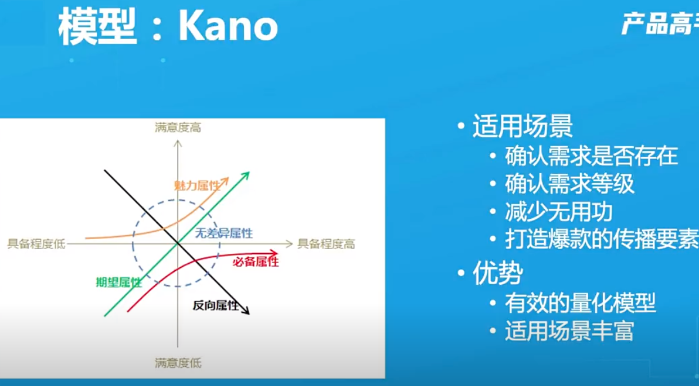
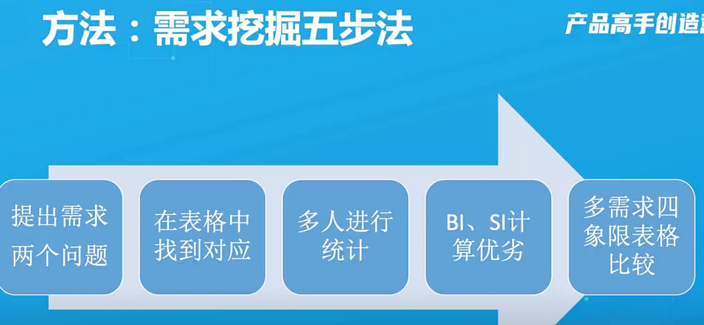
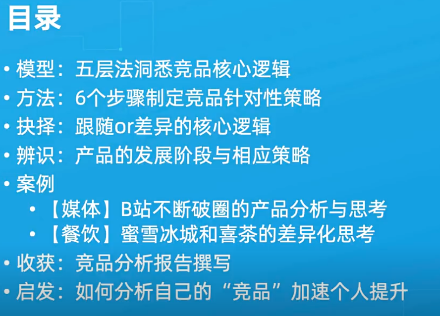
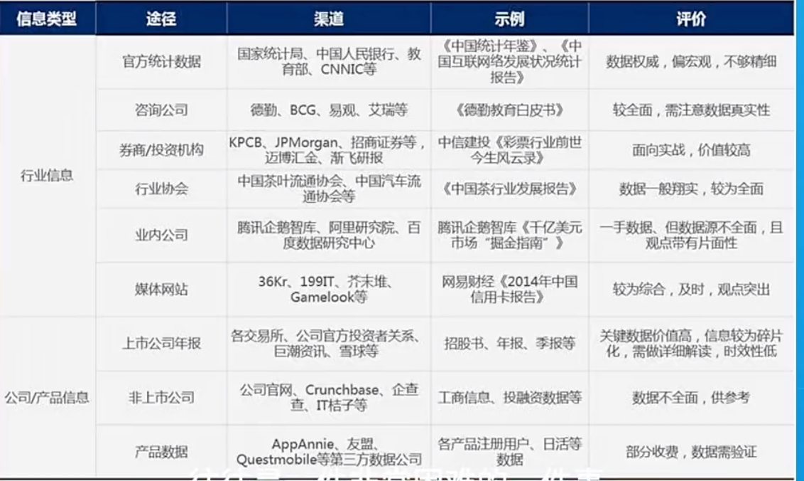

# 第一章需求分析

- pmf:产品与市场匹配

- 通过kano模型挖掘需求

- 必备属性
- 魅力属性
- 反向属性
- 无差异属性
- 期望属性

## 五部挖掘

- 使用kano模型分析需求，很多时候做的都是无差异属性，优化方向多为魅力属性，注意是客户层面的魅力属性非自己认为的魅力属性，必备属性需要稳定，修改优化提升不大，反向属性如果不是根商业模式挂钩尽量废弃，根商业模式挂钩尽量优化变柔和

# 第二章用竞品分析寻找产品提升体系

# 第二章 看清⾏业趋势，把握时代⻛⼝

- 第三方机构查看数据

- 方法步骤
