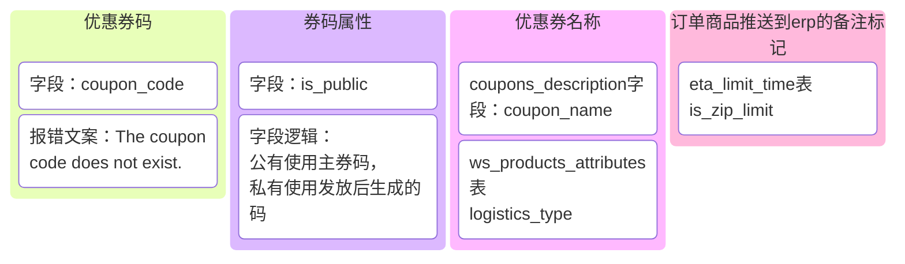

# 优惠券各个类型跟使用场景逻辑

## 优惠券类型
- 通用券
- 找回券（弃单召回时发放）
- 注册券（注册时发放）
- 订阅券（订阅时发放）
- 生日券（发送生日邮件时发放）
- EDM

## 后台优惠券选项各个逻辑

```mermaid
kanban
  优惠券码
    [字段：coupon_code]
    [报错文案：The coupon code does not exist. ]
  券码属性
    [字段：is_public]
    [字段逻辑： 
    公有使用主券码，
    私有使用发放后生成的码]
  优惠券名称
    [coupons_description字段：coupon_name]
    [ws_products_attributes表
    logistics_type]
  订单商品推送到erp的备注标记
    [eta_limit_time表
    is_zip_limit]
```
