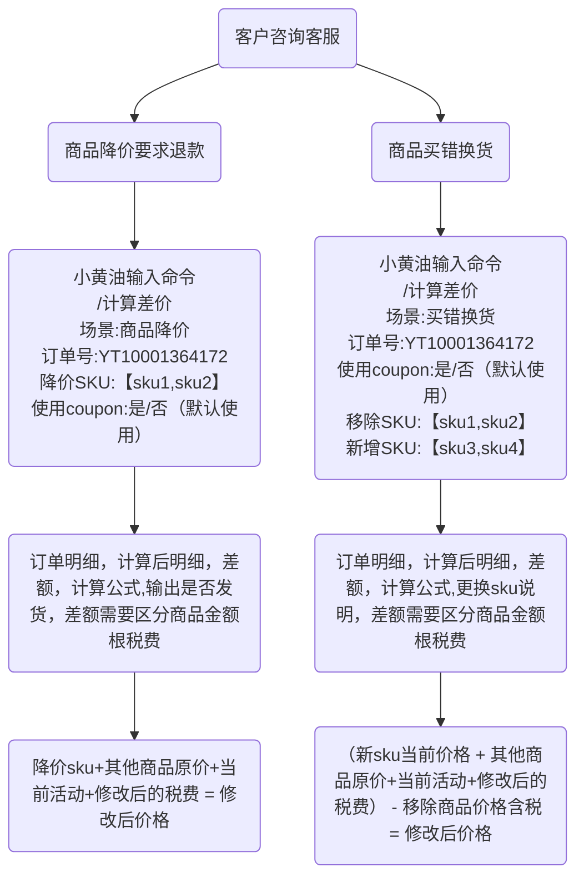

# 退换补差逻辑

```mermaid
flowchart TD
D1(客户咨询客服)
Q1(商品降价要求退款)
Q2(商品买错换货)

O1(小黄油输入命令
/计算差价
场景:商品降价
订单号:YT10001364172
降价SKU:【sku1,sku2】
使用coupon:是/否（默认使用）
)
A1(订单明细，计算后明细，差额，计算公式,输出是否发货，差额需要区分商品金额根税费)

O2(小黄油输入命令
/计算差价
场景:买错换货
订单号:YT10001364172
使用coupon:是/否（默认使用）
移除SKU:【sku1,sku2】
新增SKU:【sku3,sku4】
)
A2(订单明细，计算后明细，差额，计算公式,更换sku说明，差额需要区分商品金额根税费)


AA1(降价sku+其他商品原价+当前活动+修改后的税费 = 修改后价格 

)
AA2( （新sku当前价格 + 其他商品原价+当前活动+修改后的税费） - 移除商品价格含税 = 修改后价格)


D1 -->Q1
D1 -->Q2
Q1 -->O1
O1 -->A1
Q2 -->O2
O2 -->A2
A1 -->AA1
A2 -->AA2

```

# 计算公式

## 当前订单价格

- 当前订单价格 = 订单全部商品重新加入购物车价格-用户使用的积分-用户使用的coupon

## 商品换货
- 当前订单价格 = 更换商品sku+旧sku, 重新加入购物车价格-用户使用的积分-用户使用的coupon

## 使用coupon

- 判断新订单数据是否适用coupon，暂时人工判断