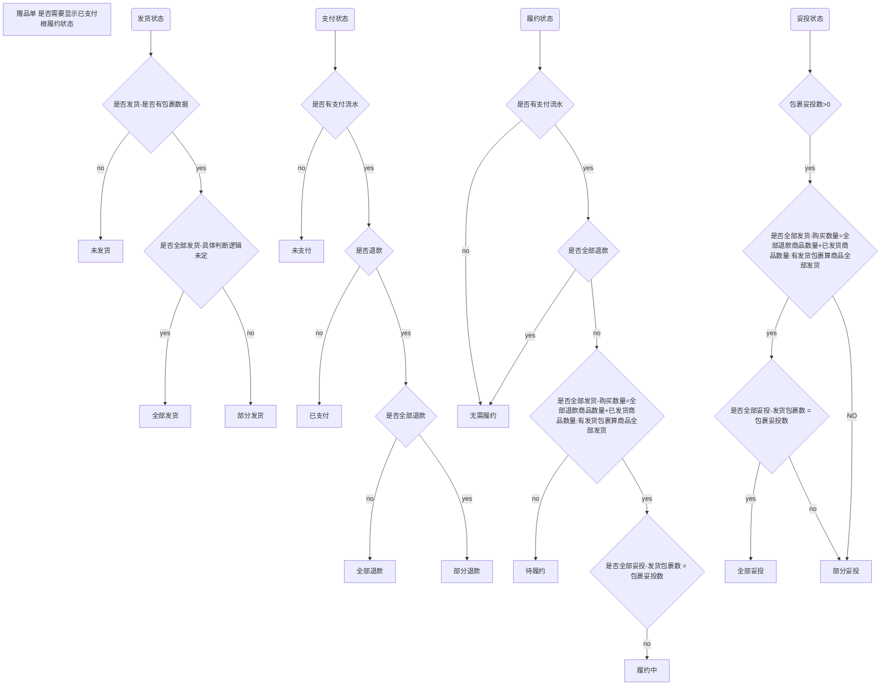
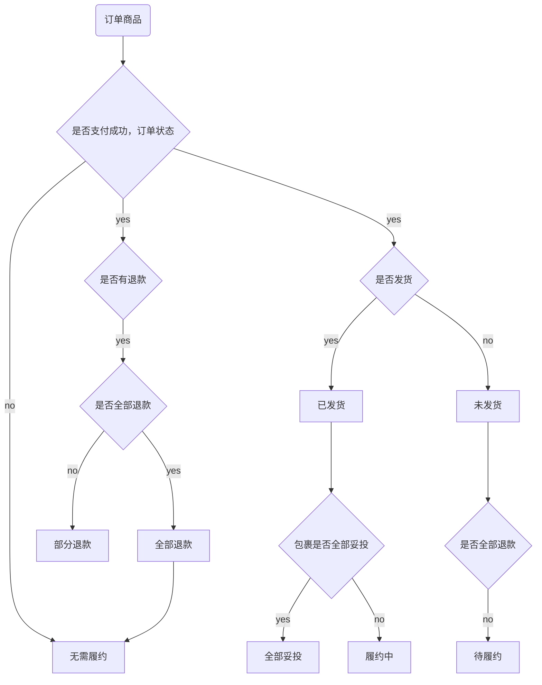

# 订单标签

## 退款标记

- 更新商品退款状态标记
```jsx  title="product_tag"
UPDATE ws_orders_products_extend AS ope
INNER JOIN (
    SELECT op.orders_products_id, op.final_price_total
    FROM ws_orders_products_refund AS opr
    LEFT JOIN ws_orders_products AS op ON op.orders_products_id = opr.orders_products_id
    WHERE op.site_id = 10001
    GROUP BY op.orders_products_id
    HAVING SUM(refund_amount) = op.final_price_total
) AS op ON op.orders_products_id = ope.orders_products_id
SET ope.is_all_refund = 1;
```

## 后台订单标签显示逻辑


## 后台商品标签显示逻辑
