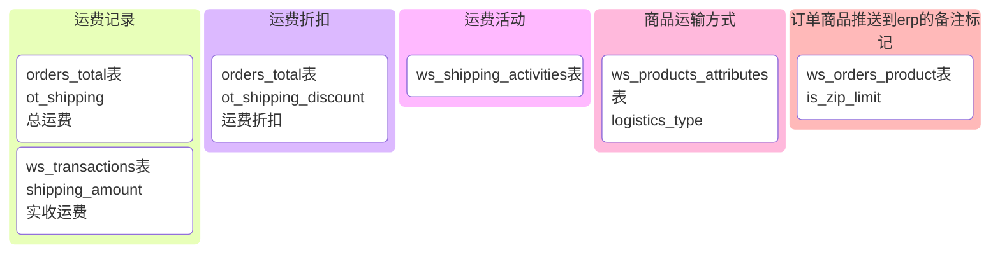
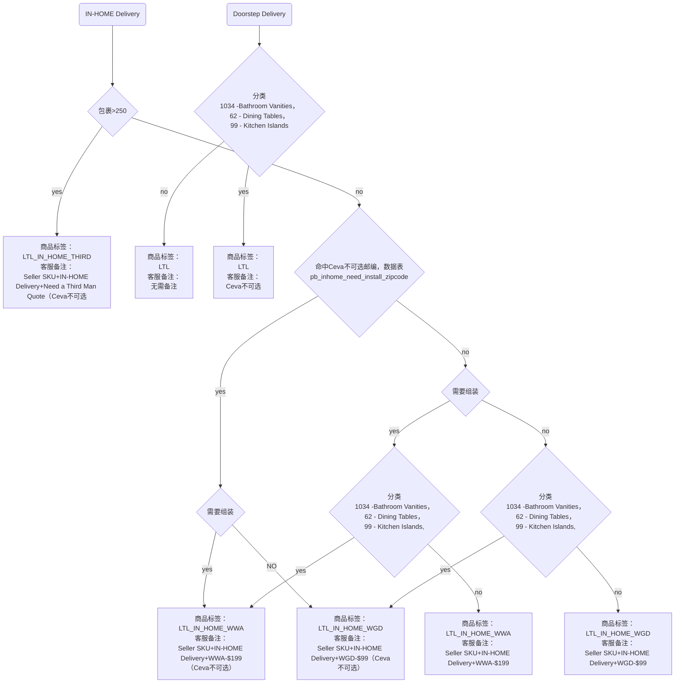

# 1.0

## 商品详情接口
- 新增返回以下数据
```jsx title="/api/product/getProductInfo"
{
    "ship_type_desc": {
        "ship_note": "",//免费标签
        "ship_note_url": "",//标签文章url
        "ship_type": "STANDARD DELIVERY",
        "ship_desc": "In Stock and Ready for Delivery to",
        "ship_type_url": "http://local.yitashop.com/article/shipping-methods.html?aid=77"
    }
}
```
- 每个类型的sku参考

| 类型 | sku_id | product_id 
| -------- | -------- | -------- | 
| 1-sp设置免费商品   | [`4197`](https://beta.yitashop.com/products/magnus-39-inch-lift-top-solid-wood-coffee-table-p-4197.html)   | [3034](https://beta.yitashop.com/sg_os/product/detail?pid=3034&type=update)
| 2-sp默认收费商品    | [`3345`](https://beta.yitashop.com/products/modern-upholstered-solid-wood-dining-chairs-set-of-2-p-3345.html)    | [2646](https://beta.yitashop.com/sg_os/product/detail?pid=2646&type=update)
| 3-ltl不提供in-home    | [`7630`](https://beta.yitashop.com/products/himmel-60-inch-desk-p-7630.html)    | [5641](https://beta.yitashop.com/sg_os/product/detail?pid=5641&type=update)  
| 4-ltl默认收费商品（可配置in-home）    | [`7909`](https://beta.yitashop.com/products/3-piece-thursen-chevron-bedroom-setgggg-p-7909.html)    | [5863](https://beta.yitashop.com/sg_os/product/detail?pid=5863&type=update)  
| 5-ltl in-home（可配置ltl）    | [`7910`](https://beta.yitashop.com/products/5-piece-thursen-chevron-bedroom-set-p-7910.html)    | [5863](https://beta.yitashop.com/sg_os/product/detail?pid=5863&type=update)  
| 6-ltl in-home（超重强制）    | [`7725`](https://beta.yitashop.com/products/thursen-63-inch-double-bathroom-vanity-p-7725.html)    | [5712](https://beta.yitashop.com/sg_os/product/detail?pid=5712&type=update)  

## 购物车接口
- 新增返回以下数据，新增参数show_group_shipping
```jsx title="/api/shopcart/getCart"
{
  "product_group": [
    {
      "sort": 1,
      "title": "STANDARD SHIPPING",
      "desc": "Delivered to the front door of your home or building.",
      "group_key": "SP",
      "group_desc": "STANDARD SHIPPING"
    },
    {
      "sort": 2,
      "title": "DOORSTEP DELIVERY",
      "sub_title": "DOORSTEP DELIVERY",
      "desc": "Delivered to your doorstep, assembly and unpacking not included.",
      "group_key": "LTL",
      "is_insert": true,
      "group_desc": "DOORSTEP DELIVERY",
      "is_select": false,//是否选中in-home
      "is_cancel": false,//是否可以取消选中选中in-home，超重商品不允许取消
      "service_code": "in_home",//判断是否需要显示勾选按钮
      "service_cost": "$199",
      "title_list": [
        "Placement in the room of your choice",
        "Assembly and unpacking",
        "Order multiple items and pay only a flat delivery fee"
      ]
    }
  ]
}
```
- 核心方法setDeliveryProduct
### 前台核心改动
- 新增shipping_free_list显示运费列表明细
- 商品数据新增ship_note 字段显示Free标签
- 购物车分组商品数据新增service_code 勾选服务交互，具体字段逻辑根checkoutv2 接口逻辑一致
- 勾选服务接口为/api/shopcart/setAppendServie
- 新增shipping_discount字段显示运费优惠
- 修改运费计算方式，根据商品运输类型，是否勾选in-home服务收费核心方法为getTotalShipCostV2，保留旧逻辑arb站使用
- 新增运费折扣，最高折扣为运费，核心方法为getShippingDiscount
- 根据逻辑新增记录订单商品标记，核心方法为getZipLimit
- 创建订单后根据setProductShipping异步进行计算标签
- 计算运费核心方法getTotalShipCostV2
- 新增的各种数据记录

## 后台订单显示逻辑

- 推送标签逻辑


