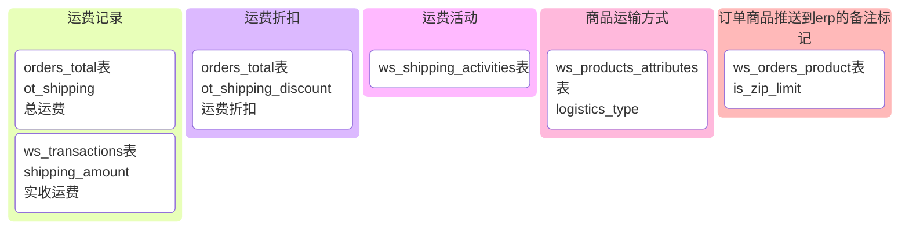
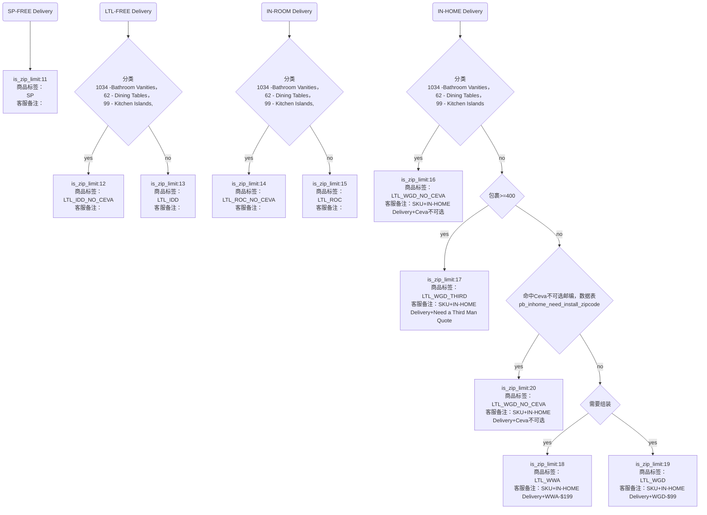

# 2.0

## 商品详情接口
- 新增返回以下数据
```jsx title="/api/product/getProductInfo"
{
    "ship_type_desc": {
        "ship_note": "",//免费标签
        "ship_note_url": "",//标签文章url
        "ship_type": "STANDARD DELIVERY",
        "ship_desc": "In Stock and Ready for Delivery to",
        "ship_type_url": "http://local.yitashop.com/article/shipping-methods.html?aid=77"
    }
}
```
- 每个类型的sku参考

| 类型 | sku_id | product_id 
| -------- | -------- | -------- | 
| 1-sp设置免费商品   | [`4197`](https://beta.yitashop.com/products/magnus-39-inch-lift-top-solid-wood-coffee-table-p-4197.html)   | [3034](https://beta.yitashop.com/sg_os/product/detail?pid=3034&type=update)
| 2-ltl设置为强制免费   | [`7630`](https://beta.yitashop.com/products/himmel-60-inch-desk-p-7630.html)    | [5641](https://beta.yitashop.com/sg_os/product/detail?pid=5641&type=update)  
| 3-ltl设置为LTL可升级（可以选择Room）     | [`7909`](https://beta.yitashop.com/products/5-piece-thursen-chevron-bedroom-set-p-7909.html)    | [5863](https://beta.yitashop.com/sg_os/product/detail?pid=5863&type=update)  
| 4-ltl设置为in-home   | [`7910`](https://beta.yitashop.com/products/5-piece-thursen-chevron-bedroom-set-p-7910.html)    | [5863](https://beta.yitashop.com/sg_os/product/detail?pid=5863&type=update)  
| 5-ltl in-home（超重强制）    | [`7725`](https://beta.yitashop.com/products/thursen-63-inch-double-bathroom-vanity-p-7725.html)    | [5712](https://beta.yitashop.com/sg_os/product/detail?pid=5712&type=update)  
| 6-闪购商品    | [`7934`](https://beta.yitashop.com/products/dorian-cotton-linen-dining-chairs-set-p-7934.html)    | [944](https://beta.yitashop.com/sg_os/activity/productGroup/detail?group_id=944)  
| 7-清仓商品    | [`7934`](https://beta.yitashop.com/products/modern-leather-upholstered-dining-chairs-with-carbon-steel-frame-set-of-2-p-4474.html)    | [862](https://beta.yitashop.com/sg_os/activity/productGroup/detail?group_id=862)
| 8-满减商品    | [`4022`](https://beta.yitashop.com/products/mid-century-modern-solid-wood-dining-table-with-pedestal-base-512-inch-p-4022.html)    | [922](https://beta.yitashop.com/sg_os/activity/productGroup/detail?group_id=922)
## 购物车接口
- 新增返回以下数据，新增参数show_group_shipping
```jsx title="/api/shopcart/getCart"
{
  "product_group": [
    {
      "sort": 1,
      "title": "STANDARD SHIPPING",
      "desc": "Delivered to the front door of your home or building.",
      "group_key": "SP",
      "group_desc": "STANDARD SHIPPING"
    },
    {
      "sort": 2,
      "title": "DOORSTEP DELIVERY",
      "sub_title": "DOORSTEP DELIVERY",
      "desc": "Delivered to your doorstep, assembly and unpacking not included.",
      "group_key": "LTL",
      "is_insert": true,
      "group_desc": "DOORSTEP DELIVERY",
      "delivery_option": //升级选项
        [
          {
              "is_select": false,//是否选中
              "is_cancel": true,
              "service_code": "in_room",
              "service_cost": "$99",
              "service_cost_activity": "$49",
              "title": "ROOM OF CHOICE",
              "title_list": [
                  "Placement in the room of your choice.",
                  "Delivery time scheduled, signature required."
              ]
          },
          {
              "is_select": true,
              "is_cancel": true,
              "service_code": "in_home",
              "service_cost": "$199",
              "service_cost_activity": "$149",
              "title": "WHITE GLOVE DELIVERY",
              "title_list": [
                  "Everything in Room of Choice.",
                  "Professional unpacking and assembly.",
                  "Hassel-free removal and recycling of all packaging."
              ]
          }
        ]
    }
  ]
}
```
- 核心方法setDeliveryProduct
### 前台核心改动
- 删除shipping_free_list显示运费列表明细
- 删除ship_note 字段显示Free标签
- 购物车分组商品数据新增delivery_option 勾选服务交互，具体字段逻辑根checkoutv2 接口逻辑一致
- 勾选服务接口为/api/shopcart/setAppendServie
- 修改运费计算方式，是否勾选in_home/in_room服务收费核心方法为getTotalShipCostV2，保留旧逻辑arb站使用
- 根据逻辑新增记录订单商品标记，核心方法为getZipLimit
- 创建订单后根据setProductShipping异步进行计算标签
- 计算运费核心方法getTotalShipCostV2
- 各种数据记录维持不变
- 计算标签去除非收运费限制

## 后台订单显示逻辑

- 推送标签逻辑


## 测试订单
3530111333300000
YT10001291350
YT10001291349
